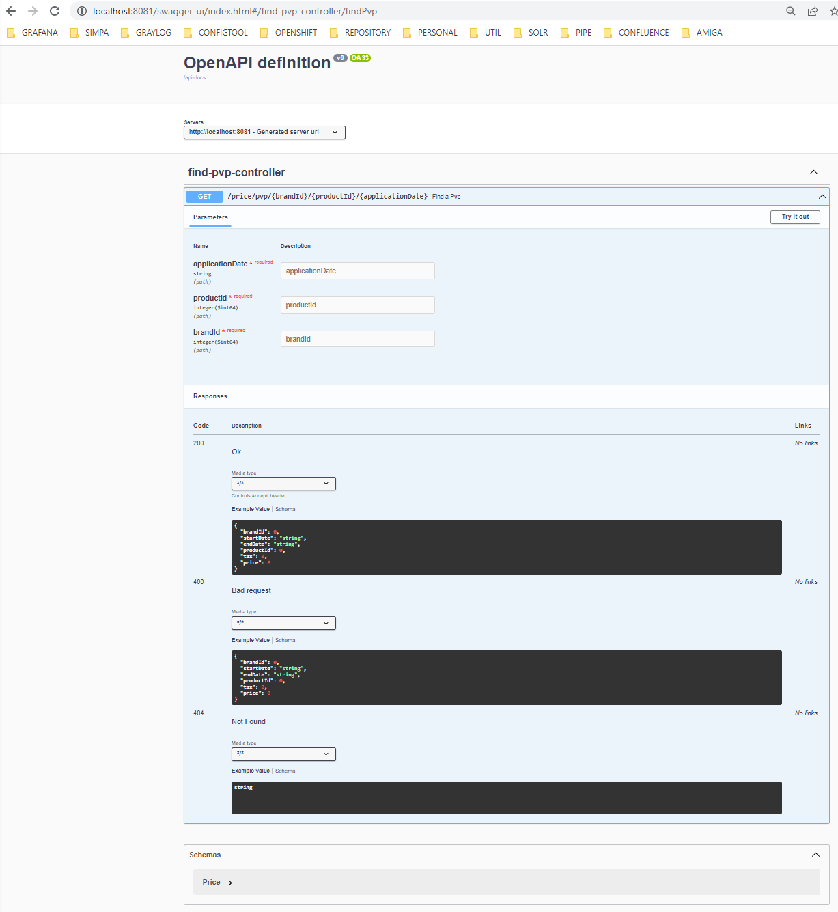

# Author
* David Makson do Nascimento Tavares
* Email: davidmakson@live.com
* Linkedin: https://es.linkedin.com/in/davidmaksondonascimentotavares/en

# Microservice using a Hexagonal Architecture
* This is a microservice that use these technologies:
* Hexagonal Architecture;
* Java 11 language;
* Spring Boot framework;
* Gradle as dependency repository;
* H2 in memory database;
* MapStruct framework;
* Lombok framework;
* JUnit tests with Mockito;
* Swagger to Open Api portal;

## Prerequisites to use this Microservice
* JDK 11
* This project uses Lombok, so enable annotation processing in your IDE
* Execute with the IDE the Application class to run the service or in gradle use the command: 
./gradlew bootRun

## The database H2 can be checked with the console Admin
* URL=http://localhost:8081/h2-console
* Datasource=jdbc:h2:mem:mydb
* Driver=org.h2.Driver
* Username=sa
* Password=password

## Open Api Portal
* http://localhost:8081/swagger-ui/index.html

## Url with example to test in Postman
* http://localhost:8081/price/pvp/1/35455/2020-12-31-23.59.59